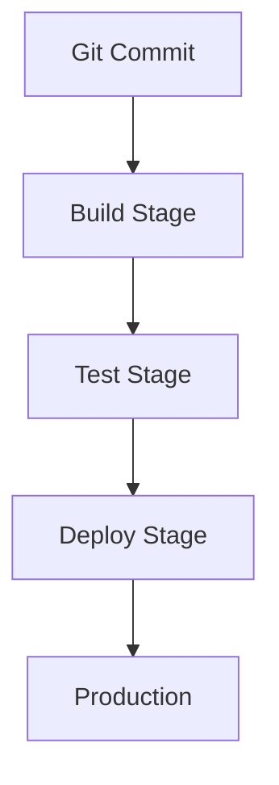

## Deployment Pipelines

Deployment pipelines in Pipeops represent the automated sequence of steps that build, test, and deploy your applications. You define a pipeline using a simple configuration file that outlines stages like build, test, and deploy. This ensures consistent and repeatable deployments across your projects.

Pipelines connect your Git repository to Pipeops, triggering on commits, pull requests, or merges. Each stage runs in isolated environments, providing visibility into failures early in the process.

<Callout kind="info">
  Start with a basic pipeline to deploy your first app. Pipeops handles the orchestration automatically.
</Callout>



## Role of Environments

Environments manage different deployment targets like development, staging, and production. You configure variables, secrets, and resource limits per environment to match real-world needs.

For example, development environments use minimal resources for quick iterations, while production scales automatically based on traffic.

<Columns cols={2}>
  <Card title="Development" icon="code" href="#">
    Fast feedback loops with hot reloads.
  </Card>
  <Card title="Staging" icon="settings" href="#">
    Mirror production for final testing.
  </Card>
  <Card title="Production" icon="rocket" href="#">
    High availability with auto-scaling.
  </Card>
</Columns>

Use environment-specific variables to avoid hardcoding sensitive data like database URLs.

## No-Code Automation Basics

Pipeops excels in no-code automation, letting you build workflows visually. Drag and drop nodes for tasks like notifications, database migrations, or API calls without writing scripts.

<Steps>
  <Step title="Create Workflow" icon="plus">
    Select the no-code builder from your dashboard.
  </Step>
  <Step title="Add Nodes" icon="settings">
    Connect build, test, and notify nodes.
  </Step>
  <Step title="Deploy" icon="rocket">
    Save and trigger the workflow.
  </Step>
</Steps>

This approach reduces errors and speeds up iteration.

## Framework-Specific Deployment Models

Pipeops provides optimized templates for popular frameworks. Choose the right model based on your stack.

<Tabs>
  <Tab title="React" icon="react">
    Deploy static sites or SPAs with zero-config builds.
    
````javascript
// pipeops.yml
pipeline:
  build: npm run build
  deploy:
    target: static
    bucket: my-react-app
````
  </Tab>
  <Tab title="Next.js" icon="nextjs">
    Support for SSR, API routes, and edge functions.
    
````javascript
// pipeops.yml
pipeline:
  build: npm run build
  deploy:
    target: nextjs
    functions: true
````
  </Tab>
  <Tab title="Laravel" icon="php">
    PHP apps with database seeding and migrations.
    
````yaml
pipeline:
  build: composer install
  deploy:
    target: php
    migrate: true
````
  </Tab>
</Tabs>

<CodeGroup tabs="React,Next.js,Laravel">
```yaml
# React
pipeline:
  build: npm ci && npm run build
```
```yaml
# Next.js
pipeline:
  build: npm ci && npm run build && npm run export
```
```yaml
# Laravel
pipeline:
  build: composer install --no-dev
  migrate: php artisan migrate
```
</CodeGroup>

<Expandable title="Advanced Pipeline Customization" default-open="false">
  Override defaults with custom scripts. For instance, integrate with `https://api.example.com` for external APIs.

  <ParamField path="app_id" param-type="string" required="true">
    Your Pipeops application identifier.
  </ParamField>

  <ParamField header="Authorization" param-type="string" required="true">
    Use `Bearer YOUR_TOKEN`.
  </ParamField>
</Expandable>

## Best Practices

- Version your pipeline configs in Git.
- Use branching strategies aligned with environments.
- Monitor deployments with built-in logs and metrics.

These concepts form the foundation for scaling your deployments with Pipeops. Explore [quickstart](/quickstart) for hands-on setup.